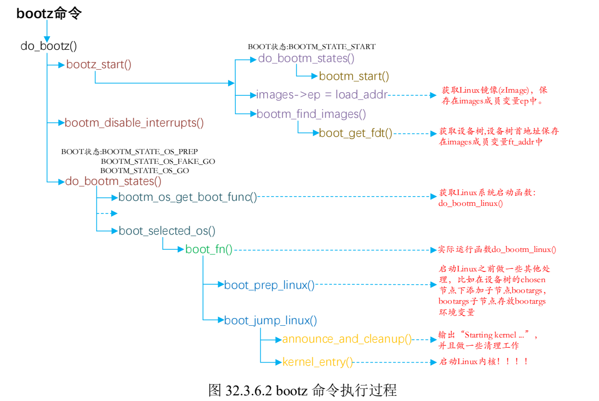

# imx6ull alpha板相关镜像构建

EMMC存储位置：

> [emmc] start addr: ,size:8GB
>
> [ddr] start addr:0x8000_0000, size:512M  (0x80000000 - 0xA0000000)

| 镜像           | 预留空间大小 | EMMC地址 | DDR地址    |
| -------------- | ------------ | -------- | ---------- |
| uboot          |              | 0        | 0x87800000 |
| zImage         | 20M          |          | 0x80800000 |
| imx6ull_xx.dtb |              |          | 0x83000000 |
| rootfs         |              |          |            |

[TOC]


# 1、uboot构建

## 1.1 启动流程

```c
[主要启动流程函数]
_start:(arch/arm/lib/vectors.S)
  --> reset [(arch/arm/cpu/armv7/start.S)]
    --> save_boot_params //跳转至 save_boot_params_ret
      --> save_boot_params_ret //设置cpu进入SVC模式，关闭中断，设置入口地址，使能向量重定位并设置向量表重定位
        --> cpu_init_cp15  //初始化cp15寄存器相关功能（关闭MMU等）
        --> cpu_init_crit  //跳转至 lowlevel_init函数
          -->lowlevel_init
        --> _main  //跳转至_main
          --> board_init_f
            --> initcall_run_list(init_sequence_f)
          --> relocate_code
          --> relocate_vectors
          --> board_init_r
      		--> initcall_run_list(init_sequence_r)
          		--> run_main_loop //3秒倒计时，3秒内按下任意按键进入uboot命令模式，否则自动启动linux内核
```

### 1.1.1 lowlevel_init

```c
lowlevel_init:(arch/arm/cpu/armv7/lowlevel_init.S)
  --> //设置sp首地址：CONFIG_SYS_INIT_SP_ADDR, 在头文件定义(include/configs/mx6ullevk.h)
      //imx6ull 内部OCRAM首地址： 0x00900000 ，大小：128k （0x00020000）最终sp地址：0x0091FF00
  --> //sp地址减去global data结构体大小248，并做8字节对其，最终sp地址：0x0091FE08
  --> s_init // 跳转至s_init函数
    --> //对于MX6ULL类型cpu，该函数为空，直接返回
```

### 1.1.2 _main

```c
_main:(arch/arm/lib/crt0.S)
  --> //设置sp首地址并8字节对齐：CONFIG_SYS_INIT_SP_ADDR，为0x0091FF00
  --> board_init_f_alloc_reserve (common/init/board_init.c)
      --> //留出早期的malloc内存区和gd内存区域，返回top地址赋值给sp，sp地址为0x0091FA00
  --> //uboot设置R9寄存器存放gd的地址，设置R9地址，即设置gd的地址为0x0091FA00
  --> board_init_f_init_reserve (common/init/board_init.c)
      --> //初始化清零gd， gd->malloc_bace=0x0091FB00
  --> board_init_f (common/board_f.c)
      --> //初始化DDR，定时器，完成代码拷贝等
  --> //重新设置sp gd， sp=df->start_addr_sp(在board_init_f内赋值)=0x9EF44E90，由此sp从内容OCRAM区域变更为DDR区域
  --> //重新计算gd地址， gd->relocaddr=0x9FF47000，此地址为代码拷贝目的地址
  --> relocate_code (arch/arm/lib/relocate.S)
      --> //将uboot拷贝到新的地方去
  --> relocate_vectors (arch/arm/lib/relocate.S)
      --> //中断向量表做重定位
  --> c_runtime_cpu_setup (arch/arm/cpu/armv7/start.S)
      --> //设置board_init_r函数入参，参数1为gd地址，参数2为目的地址：gd->relocaddr
  --> board_init_r (common/board_r.c)
```

#### 1.1.2.1 board_init_f

1.初始化一系列外设，如串口、定时器等
2.初始化gd各成员变量，uboot将自己重定位到DRAM最后面的区域，给linux让出空间，防止linux内核覆盖掉uboot

```c
board_init_f：(common/board_f.c)
  --> //初始化gd
  --> initcall_run_list(init_sequence_f) //执行一系列初始化函数，主要如下
    --> setup_mon_len //设置gd的mon_len成员变量,此处为__bss_end-_start,即整个uboot代码长度
    --> initf_malloc //初始化gd中malloc相关变量，内存池大小默认为0x400
    --> initf_console_record //相关宏未定义，不执行
    --> arch_cpu_init/initf_dm/arch_cpu_init_dm/mark_bootstage
    --> board_early_init_f //初始化串口IO
    --> timer_init //初始化CortexA 内核定时器，为uboot提供时间
    --> board_postclk_init //设置VDDSOC电压
    --> get_clocks //获取sdhc_clk,即sd卡外设时钟
    --> env_init //uboot环境变量初始化，设置gd的成员变量env_addr
    --> init_baud_rate //初始化波特率，依据环境变量中的baudrate来初始化gd->baudrate
    --> serial_init //串口初始化
    --> console_init_f //console控制台初始化，并打印前面暂存的数据
    --> display_options //通过串口输出一些信息
    --> display_text_info //打印文本信息，如果开启UBOOT的DEBUG功能，将打印text_base,bss_start,bss_end
    --> print_cpuinfo //打印cpu信息
    --> show_board_info //打印板子信息，会调用checkboard函数
    --> INIT_FUNC_WATCHDOG_INIT、INIT_FUNC_WATCHDOG_RESET //初始化看门狗、复位看门狗，6ull无此
    --> init_func_i2c //初始化IIC
    --> announce_dram_init //输出字符串"DRAM:"
    --> dram_init //并非真正的初始化DDR，只设置gd->ram_size=512MB
    --> setup_dest_addr //设置重定位后的目的地址，包括ram_size,ram_top,relocaddr
      //最终为：0x20000000,0xA0000000,0xA0000000
    --> reserve_round_4k // relocaddr 4K对齐
    --> reserve_mmu // 预留MMU的TLB表位置，分配后relocaddr做64K对齐
      //tlb_size=0x4000, tlb_addr(0x9FFF0000),relocaddr(0x9FFF0000)
    --> reserve_trace //预留trace功能的内存(如果存在)
    --> reserve_uboot //留出重定位后的uboot所占的内存区域，uboot大小为gd->mon_len(实际镜像大小)
      //relocaddr做4K对齐，并重新设置start_addr_sp
    --> reserve_malloc //留出malloc区域，调整gd->start_addr_sp位置, TOTAL_MALLOC_LEN=0X1002000(16M+8K)
    --> reserve_board //留出bd参数(bd_t)占用的内存区,size=80 byte
    --> setup_machine //老版本uboot与linux使用，此处无效
    --> reserve_global_data //留出gd参数(gd_t)占用的内存区，size=248 byte
    --> reserve_fdt //留出设备树相关的内存区，uboot未使用
    --> reserve_stacks //留出栈空间，(arch/arm/lib/stack.c)
    --> setup_dram_config //设置dram信息， gd->bd->bi_dram[0].start=0x80000000, size=0x20000000
    --> show_dram_config //显示DRAM(DDR)配置信息
    --> display_new_sp //显示start_addr_sp(需定义DEBUG宏)
    --> reloc_fdt //重定位fdt，未使用
    --> setup_reloc //设置gd的其它成员变量(需定义DEBUG宏才打印),并且将gd拷贝到gd->new_gd(需定义DEBUG宏才可打印)

```

ram内存分布示意图

> gd->bd = 0x9FFF0000 - [mon_len ]- [malloc_size] - 80;
>
> gd->new_gd = gd->bd - 248;
>
> gd->start_addr_sp = gd->new_gd - [stack_size]

| RAM地址                            | size                              | 说明                    |
| ---------------------------------- | --------------------------------- | ----------------------- |
| 0x80000000                         |                                   | DDR 首地址              |
| ...                                | ...                               | ...                     |
| gd->start_addr_sp                  | reserve_stacks                    | stack内存区(16字节对齐) |
| gd->new_gd                         | reserve_global_data=248B          | gd参数                  |
| gd->bd                             | reserve_board=80B                 | board参数               |
| 0x9FFF0000 - mon_len - malloc_size | reserve_malloc=16MB+8KB           | malloc内存池            |
| 0x9FFF0000-mon_len                 | reserve_uboot=mon_len(uboot size) | uboot拷贝在ddr处的镜像  |
| 0x9FFF0000                         | reserve_trace=0                   | trace预留空间，未使用   |
| 0x9FFF0000                         | reserve_mmu=0x4000                | MMU预留空间，16K        |
| 0xA0000000                         | reserve_round_4k=0                | 4K字节对齐              |

#### 1.1.2.2 relocate_code

```c
-->relocate_code (arch/arm/lib/relocate.S)
  --> //r1=__image_copy_start=0x87800000, 保存源地址
  --> //r0=gd->relocaddr, r4=r0-r1=relocation offset,r4保存偏移量
  --> //检查r0与r1是否相等，若相等执行relocate_done
  --> //r2=__image_copy_end=0x87800000+image_size
  --> //copy_loop，拷贝镜像
  --> //重定位.rel.dyn段,并进行拷贝 .rel.dyn段是存放.text段中需要重定位地址的集合
```

#### 1.1.2.3 relocate_vectors

```c
-->relocate_vectors (arch/arm/lib/relocate.S)
  --> //重定位向量表
  --> //r0=gd->relocaddr重定位后uboot的首地址,将 r0 的值写入到 CP15 的 VBAR 寄存器
```

#### 1.1.2.4 board_init_r

> board_init_f 并没有初始化所有的外设，后续工作由函数 board_init_r 来完成

```c
-->board_init_r (common/board_r.c)
 --> initcall_run_list(init_sequence_r)
     --> initr_trace //如果定义了CONFIG_TRACE，初始化和调试跟踪有关的内容
     --> initr_reloc //设置gd->flag，标记重定位完成
     --> initr_caches //初始化cache并使能
     --> initr_reloc_global_data //初始化重定位后的gd成员
     --> initr_barrier //imx6ull未使用
     --> initr_malloc  //初始化malloc
     --> initr_console_record //初始化控制台相关，未使用
     --> bootstage_relocate //启动状态重定位
     --> initr_bootstage //bootstage
     --> board_init //板级初始化，执行mx6ull_alientek_emmc.c里的board_init函数，初始化74XX芯片，I2C、FEC、USB和QSPI等
     --> stdio_init_tables //stdio 相关初始化
     --> initr_serial //初始化串口
     --> initr_announce //调试有关，通知已经在RAM中运行
     --> power_init_board //初始化电源芯片，未使用
     --> initr_flash //定义CONFIG_SYS_NO_FLASH才有效，未使用
     --> initr_nand //初始化nand
     --> initr_mmc  //初始化emmc
     --> initr_env  //初始化环境变量
     --> initr_secondary_cpu //初始化其他CPU核,多核soc有效
     --> stdio_add_devices //各种输入输出设备的初始化,如LCD 这里使用drv_video_init初始化LCD
     --> initr_jumptable //初始化跳转表
     --> console_init_r //控制台初始化
     --> interrupt_init //中断初始化
     --> initr_enable_interrupts //中断使能
     --> initr_ethaddr //初始化网络地址，读取环境变量"ethaddr"的值
     --> board_late_init //板子后续初始化，定义在mx6ull_alientek_emmc.c
    	//如果环境变量存储在EMMC或者SD卡中的话此函数会调用board_late_mmc_env_init函数初始化EMMC/SD，并切换到正在使用的emmc设备
     --> initr_net //初始化网络设备,initr_net --> eth_initialize --> board_eth_init()，
     --> run_main_loop //主循环
```

### 1.1.3 bootz命令




## 1.2 基于NXP官方uboot移植

### 1.2.1前期准备

将源uboot （这里使用正点原子资料包中的ubootimx-rel_imx_4.1.15_2.1.0_ga.tar.bz2）拷贝至ubuntu，进行解压

`tar -xvjf ubootimx-rel_imx_4.1.15_2.1.0_ga.tar.bz2`

将解压后的文件夹重命名为**uboot**文件夹并拷贝至项目文件夹内（这里命名为imx6ll），在项目文件夹内创建Makefile、Rules.make文件及build_uboot.sh文件

在同级目录下创建一个makerules文件夹，并新建文件uboot_makefile

目录结构如下：

```C
-->[imx6ull]
    --> [uboot] //nxp官方uboot，原名ubootimx-rel_imx_4.1.15_2.1.0_ga
    --> [makerules]
    	-> Makefile_uboot
    -> Makefile
    -> Rules.make
    -> build_uboot.sh
```

### 1.2.2添加开发板默认配置文件

在config目录下创建默认配置文件，复制mx6ull_14x14_evk_emmc_defconfig作为源配置，复制为**mx6ull_alpha_emmc_defconfig**。

```shell
cd configs
cp mx6ull_14x14_evk_emmc_defconfig mx6ull_alpha_emmc_defconfig
```

修改deconfig第1、4行内容

```makefile
CONFIG_SYS_EXTRA_OPTIONS="IMX_CONFIG=board/freescale/mx6ull_alpha_emmc/imximage.cfg,MX6ULL_EVK_EMMC_REWORK"
CONFIG_ARM=y
CONFIG_ARCH_MX6=y
CONFIG_TARGET_MX6ULL_ALPHA_EMMC=y
CONFIG_CMD_GPIO=y
```

### 1.2.3添加开发板对应的头文件

在include/configs目录下添加alpha板对应的头文件，该头文件负责用于配置uboot，要使能或禁止uboot的某些功能，在该文件内做修改即可。

```shell
cp include/configs/mx6ullevk.h include/configs/mx6ull_alpha_emmc.h
```

修改头文件宏定义为**__MX6ULL_ALPHA_EMMC_CONFIG_H**

头文件关键设置：

```
line29-39：PHYS_SDRAM_SIZE 设置DRAM大小，alpha板的DDR大小为512M，无需修改
line50-51：CONFIG_DISPLAY_CPUINFO，CONFIG_DISPLAY_BOARDINFO 输出cpu和board信息
line54：CONFIG_SYS_MALLOC_LEN 设置malloc内存池大小，默认为16M
line59-60：CONFIG_MXC_UART_BASE 设置串口基地址，使能串口功能
line63-64：CONFIG_SYS_FSL_ESDHC_ADDR 设置emmc基地址，此处使用的为USDHC2
line75-81：I2C相关设置
line98-111：CONFIG_MFG_ENV_SETTINGS mfg烧录工具使用的环境变量
line113-202：CONFIG_EXTRA_ENV_SETTINGS 设置环境变量，该宏也会设置bootargs变量
line204-217：CONFIG_BOOTCOMMAND 设置bootcmd环境变量
line224：CONFIG_SYS_LOAD_ADDR 设置linux kernel在DDR RAM中的加载地址，此处设为0x80800000
line225：CONFIG_SYS_HZ 系统时钟频率，1KHZ
line227：CONFIG_STACKSIZE stack大小，128KB
line231-233：CONFIG_SYS_SDRAM_BASE DRAM起始地址，0x80000000
line234-235：CONFIG_SYS_INIT_RAM_ADDR，CONFIG_SYS_INIT_RAM_SIZE 内部OCRAM的起始地址，0x00900000,size=128KB
line256：CONFIG_SYS_MMC_ENV_DEV 默认的MMC设备，默认设置为USDHC2即emmc
line257：CONFIG_SYS_MMC_ENV_PART 模式分区，默认为第0个分区
line258：CONFIG_MMCROOT 设置linux系统的根文件系统所在分区，默认设置为“/dev/mmcblk1p2”，即emmc的第2个分区。emmc第0分区保存uboot，第1分区为kernel和设备树文件，第2分区为rootfs
line293：CONFIG_ENV_SIZE 设置环境变量大小，默认8K
```

### 1.2.4添加开发板对应的板级文件夹

uboot中每个板子都有一个对应的文件夹来存放板级文件，如开发板上的外设驱动文件等。复制board/freescale/mx6ullevk文件夹作为项目板级文件夹。

```shell
cd board/freescale/
cp mx6ullevk/ -r mx6ull_alpha_emmc
```

进入文件夹，重命名mx6ullevk.c为**mx6ull_alpha_emmc.c**

```shell
cd mx6ull_alpha_emmc
mv mx6ullevk.c mx6ull_alpha_emmc.c
```

将文件夹内所有文件中的*mx6ullevk*修改为***mx6ull_alpha_emmc***

#### 1.2.4.1修改Makefile

修改第6行，这样才能编译自己的c文件

```makefile
obj-y  := mx6ull_alpha_emmc.o
```

#### 1.2.4.2修改imximage.cfg文件

修改第34行为

```
PLUGIN	board/freescale/mx6ull_alpha_emmc/plugin.bin 0x00907000
```

#### 1.2.4.3修改Kconfig文件

宏定义改为deconfig中修改的***TARGET_MX6ULL_ALPHA_EMMC***，添加SOC定义

```
if TARGET_MX6ULL_ALPHA_EMMC

config SYS_BOARD
	default "mx6ull_alpha_emmc"

config SYS_VENDOR
	default "freescale"

config SYS_CONFIG_NAME
	default "mx6ull_alpha_emmc"

config SYS_SOC
	default "mx6"

endif
```

#### 1.2.4.4修改MAINTAINERS文件

删除最后两行，修改后如下：

```
MX6ULL_ALPHA_EMMC BOARD
M:	Peng Fan <peng.fan@nxp.com>
S:	Maintained
F:	board/freescale/mx6ull_alpha_emmc/
F:	include/configs/mx6ull_alpha_emmc.h
```

#### 1.2.4.5uboot图形界面配置支持

如果需要使用图形界面配置，需修改文件*arch/arm/cpu/armv7/mx6/Kconfig*，参考EVK设置，在241行加入以下内容：

```
config TARGET_MX6ULL_ALPHA_EMMC
	bool "Support mx6ull_alpha_emmc"
	select MX6ULL
	select DM
	select DM_THERMAL

```

并在287行新增添加

```
source "board/freescale/mx6ull_alpha_emmc/Kconfig"
```

#### 1.2.4.6LCD驱动修改

一般uboot中修改驱动基本在xxx.c和xxx.h进行，xxx为板子名称，在本项目中为**mx6ull_alpha_emmc.c**/**mx6ull_alpha_emmc.h**

正点原子ALPHA开发板LCD原理图与官方板IO设置一致，因此IO部分不用修改。需修改LCD参数，该参数定义在第780行displays[]处。

> 以正点原子4.3寸800*480LCD屏幕为例，配置如下

```C
struct display_info_t const displays[] = {{
	.bus = MX6UL_LCDIF1_BASE_ADDR,
	.addr = 0,
	.pixfmt = 24,
	.detect = NULL,
	.enable	= do_enable_parallel_lcd,
	.mode	= {
		.name			= "ATK-LCD-4.3-800x480",
		.xres           = 800,
		.yres           = 480,
		.pixclock       = 10119,
		.left_margin    = 210,
		.right_margin   = 46,
		.upper_margin   = 22,
		.lower_margin   = 23,
		.hsync_len      = 20,
		.vsync_len      = 3,
		.sync           = 0,
		.vmode          = FB_VMODE_NONINTERLACED
} } };
```

在***mx6ull_alpha_emmc.h***头文件中找到panel语句，panel名称需与设置的LCD name参数一致。修改CONFIG_EXTRA_ENV_SETTINGS参数第140行

```
"panel=ATK-LCD-4.3-800x480\0" \
```

以上参数需在EMMC未存储过panel环境变量才生效，如果emmc存储的环境变量设置过panel参数，需在uboot的命令模式下输入如下命令进行更改。

```shell
setenv panel ATK-LCD-4.3-800x480
saveenv
```

#### 1.2.4.7网络驱动修改

ALPHA板相较于EVK板，PHY芯片从KSZ8081替换成了LAN8720A（V2.4版本前），因此需要进行网络驱动的修改。

ENET1修改点：1、复位引脚(SNVS_TAMPER7)  2、LAN8720A的器件ID=0x0  3、LAN8720A驱动

ENET2修改点：1、复位引脚(SNVS_TAMPER8)  2、LAN8720A的器件ID=0x1  3、LAN8720A驱动

**①PHY地址修改**

在***mx6ull_alpha_emmc.h***头文件中找到ENET相关设置（line325开始）

```
line331：默认网口为1，即ENET2。如果需切换ENET1，修改CONFIG_FEC_ENET_DEV设置0
line335：将CONFIG_FEC_MXC_PHYADDR 0x2 修改为0x0
line345：将CONFIG_PHY_MICREL 修改为 CONFIG_PHY_SMSC（LAN8720A为SMSC公司生产，使能uboot SMSC PHY驱动）
```

**②删除74LV595驱动代码**

PHY芯片地址修改完成后，接着初始化复位引脚。74LV595为EVK板的拓展IO芯片，ALPHA板无此芯片，因此需删除多余代码。在***mx6ull_alpha_emmc.c***进行代码修改。

找到**IOX_SDI**相关定义（line91），该定义为拓展IO芯片相关代码，将其删除

```C
#define IOX_SDI IMX_GPIO_NR(5, 10)
#define IOX_STCP IMX_GPIO_NR(5, 7)
#define IOX_SHCP IMX_GPIO_NR(5, 11)
#define IOX_OE IMX_GPIO_NR(5, 8)

static iomux_v3_cfg_t const iox_pads[] = {
	/* IOX_SDI */
	MX6_PAD_BOOT_MODE0__GPIO5_IO10 | MUX_PAD_CTRL(NO_PAD_CTRL),
	/* IOX_SHCP */
	MX6_PAD_BOOT_MODE1__GPIO5_IO11 | MUX_PAD_CTRL(NO_PAD_CTRL),
	/* IOX_STCP */
	MX6_PAD_SNVS_TAMPER7__GPIO5_IO07 | MUX_PAD_CTRL(NO_PAD_CTRL),
	/* IOX_nOE */
	MX6_PAD_SNVS_TAMPER8__GPIO5_IO08 | MUX_PAD_CTRL(NO_PAD_CTRL),
};
```

替换为ALPHA板复位管脚配置：SNVS_TAMPER7对应GPIO5_IO07，SNVS_TAMPER8对应GPIO5_IO08

```c
#define ENET1_RESET IMX_GPIO_NR(5, 7)
#define ENET2_RESET IMX_GPIO_NR(5, 8)
```

删除**iox74lv_init**、**iox74lv_set**函数及其在**board_init**函数调用处

**③添加复位引脚驱动**

在fec1_pads，fec2_pads结构体数组添加复位IO配置参数

```C
fec1_pads[] = {
...
MX6_PAD_SNVS_TAMPER7__GPIO5_IO07 | MUX_PAD_CTRL(NO_PAD_CTRL),
}
fec2_pads[]={
...
MX6_PAD_SNVS_TAMPER8__GPIO5_IO08 | MUX_PAD_CTRL(NO_PAD_CTRL),
}
```

在*setup_iomux_fec*函数添加复位代码

```C
	if (fec_id == 0)
	{
		imx_iomux_v3_setup_multiple_pads(fec1_pads,
						 ARRAY_SIZE(fec1_pads));
		
		gpio_direction_output(ENET1_RESET, 1);
		gpio_set_value(ENET1_RESET, 0);
		mdelay(20);
		gpio_set_value(ENET1_RESET, 1);
	}
	else
	{
		imx_iomux_v3_setup_multiple_pads(fec2_pads,
						 ARRAY_SIZE(fec2_pads));
		
		gpio_direction_output(ENET2_RESET, 1);
		gpio_set_value(ENET2_RESET, 0);
		mdelay(20);
		gpio_set_value(ENET2_RESET, 1);
	}
```

**④修改 drivers/net/phy/phy.c 文件中的函数 genphy_update_link**

uboot 中的 LAN8720A 驱动有点问题，进行如下代码添加（添加等待软件复位操作）：

```C
int genphy_update_link(struct phy_device *phydev)
{
	unsigned int mii_reg;

#ifdef CONFIG_PHY_SMSC
        static int lan8720_flag = 0;
        int bmcr_reg = 0;

        if(lan8720_flag == 0)
        {
                bmcr_reg = phy_read(phydev, MDIO_DEVAD_NONE, MII_BMCR);   /* Read the default value of BCMR register */
                phy_write(phydev, MDIO_DEVAD_NONE, MII_BMCR, BMCR_RESET); /* Software reset*/
                mdelay(10);
                phy_write(phydev, MDIO_DEVAD_NONE, MII_BMCR, bmcr_reg);   /* Write the default value to BCMR register */
                lan8720_flag = 1;
        }
#endif

	/*
	 * Wait if the link is up, and autonegotiation is in progress
	 * (ie - we're capable and it's not done)
	 */
	mii_reg = phy_read(phydev, MDIO_DEVAD_NONE, MII_BMSR);
	...
}
```

1.2.4.8 其它修改

修改board信息打印，在*checkboard*函数修改borad信息

```C
int checkboard(void)
{
	if (is_mx6ull_9x9_evk())
		puts("Board: MX6ULL 9x9 EVK\n");
	else
		puts("Board: MX6ULL ALPHA EMMC\n");

	return 0;
}
```

## 1.3 创建编译脚本

> 参考正点原子文档教程创建编译脚本，这里额外添加个人的makefile配置。

### 1.3.1 Rules.make

在**Rules.make**(imx6ull/Rules.make)文件添加如下内容：

```makefile

### PLATFORM CONFIG ###
#platform
PLATFORM=imx6ull_alpha_board
SOC=mx6

ARMV7=a7

#u-boot machine
UBOOT_MACHINE=mx6ull_alpha_emmc_defconfig

MAKE_ALL_TARGETS?= u-boot linux linux-dtbs linux-fitImage

#Points to the root of the project
export PROJ_ROOT_PATH?=$(shell realpath ./)
export PROJ_BINARY_OUT?=$(PROJ_ROOT_PATH)/binary

#Points to the root of the CROSS_COMPILE_PATH
# export CROSS_COMPILE_PATH?=/usr/local/arm/gcc-linaro-6.5.0-2018.12-x86_64_arm-linux-gnueabihf/

#Set cross compilers
ifneq ($(CROSS_COMPILE_PATH),)
export CROSS_COMPILE=$(CROSS_COMPILE_PATH)/bin/arm-linux-gnueabihf-
else
export CROSS_COMPILE=arm-linux-gnueabihf-
endif

# The source directories for each component
UBOOT_SRC_DIR=$(shell find $(PROJ_ROOT_PATH) -maxdepth 1 -type d -name "ubootimx-*")
LINUXKERNEL_INSTALL_DIR=$(shell find $(PROJ_ROOT_PATH) -maxdepth 1 -type d -name "linux-kernel-*")

# The source build directories
UBOOT_A7_BUILD?=build
LINUX_KERNEL_BUILD?=build

```

在该文件中，定义了make目标物（u-boot / linux-kernel等）、交叉编译器的安装地址、u-boot源代码地址、u-boot配置文件、u-boot编译输出路径等，供顶层Makefile调用。

### 1.3.2 顶层Makefile

在项目顶层**Makefile**(imx6ull/Makefile)中添加如下内容：

```makefile
.NOTPARALLEL:

### Include Config ###
include Rules.make

### Define Global Makerules
all: $(MAKE_ALL_TARGETS)
clean: $(patsubst %,%_clean,$(MAKE_ALL_TARGETS))
install: $(patsubst %,%_install,$(MAKE_ALL_TARGETS))
menuconfig: $(patsubst %,%_menuconfig,$(MAKE_ALL_TARGETS))

list-targets:
	@echo Below targets are supported by the Makefile for PLATFORM=$(PLATFORM)
	@echo $(MAKE_ALL_TARGETS)

### Include MakeRules ###
include makerules/Makefile_*

```

顶层Makefile引用*makerules*文件夹下的u-boot/linux-kernel等makefile，实现各种功能。

### 1.3.3 Makefile_uboot

在项目文件夹*imx6ull/makerules*下，创建**Makefile_uboot**，添加如下内容：

```makefile
# U-Boot targets for imx6ull 

u-boot:
	@echo ===================================
	@echo    Building U-boot for $(ARMV7)
	@echo ===================================
	$(MAKE) -j -C $(UBOOT_SRC_DIR) ARCH=arm CROSS_COMPILE=$(CROSS_COMPILE) $(UBOOT_MACHINE) \
		O=$(UBOOT_A7_BUILD)
	$(MAKE) -j -C $(UBOOT_SRC_DIR) ARCH=arm CROSS_COMPILE=$(CROSS_COMPILE) \
		O=$(UBOOT_A7_BUILD)

u-boot_menuconfig:
	@echo ===================================
	@echo    Building U-boot menuconfig for $(ARMV7)
	@echo ===================================
	$(MAKE) -j -C $(UBOOT_SRC_DIR) \
		ARCH=arm CROSS_COMPILE=$(CROSS_COMPILE) $(UBOOT_MACHINE) \
		O=$(UBOOT_A7_BUILD)
	$(MAKE) -j -C $(UBOOT_SRC_DIR) \
		ARCH=arm CROSS_COMPILE=$(CROSS_COMPILE) menuconfig\
		O=$(UBOOT_A7_BUILD)
	$(MAKE) -j -C $(UBOOT_SRC_DIR) \
		ARCH=arm CROSS_COMPILE=$(CROSS_COMPILE) \
		O=$(UBOOT_A7_BUILD)

u-boot_clean:
	@echo ===================================
	@echo    Cleaning U-boot for $(ARMV7)
	@echo ===================================
	$(MAKE) -C $(UBOOT_SRC_DIR) CROSS_COMPILE=$(CROSS_COMPILE) \
		distclean \
		O=$(UBOOT_A7_BUILD)

u-boot_install:
	@echo ===================================
	@echo    Copy U-boot binary
	@echo ===================================
	mkdir -p $(PROJ_BINARY_OUT)
	cp -rf $(UBOOT_SRC_DIR)/$(UBOOT_A7_BUILD)/u-boot.bin $(PROJ_BINARY_OUT)/

```

该文件定义各个u-boot的编译目标，调用u-boot源码顶层makefile实现目标产物编译。

### 1.3.4 build_uboot.sh

上述三个makefile文件创建完成后，即可在项目顶层目录，terminal下执行如下指令进行编译u-boot

```shell
make u-boot_clean
make u-boot
make u-boot_install
```

最终编译生成的u-boot.bin文件被拷贝至binary文件夹下。

还可通过shell脚本执行，创建build_uboot.sh，添加如下内容：

```shell
#!/bin/bash
make u-boot_clean
if [ $? -ne 0 ]; then
  echo "make u-boot_clean failed!!!"
  exit
fi

make u-boot
if [ $? -ne 0 ]; then
  echo "make u-boot failed!!!"
  exit
fi

make u-boot_install
```

直接执行./build_uboot.sh即可实现u-boot编译。

### 1.3.5 uboot烧录至sd卡

拷贝正点原子提供的sd卡烧录文件**imxdownload**至*binary*文件夹下，执行如下指令

```shell
chmod 777 imxdownload
./imxdownload u-boot.bin /dev/sdb
```

u-boot默认是通过nfs网络加载linux kernel，sd卡烧录完成后无法启动linux内核。正点原子alpha板子出厂默认对emmc烧录了所有镜像，在进入uboot命令模式后，设置bootargs和bootcmd这两个环境变量

```shell
setenv bootargs 'console=ttymxc0,115200 root=/dev/mmcblk1p2 rootwait rw'
setenv bootcmd 'mmc dev 1; fatload mmc 1:1 80800000 zImage; fatload mmc 1:1 83000000 imx6ull-alientek-emmc.dtb; bootz 80800000 - 83000000;'
saveenv

//SD卡启动
bootargs=console=ttymxc0,115200 root=/dev/mmcblk0p2 rootwait rw
bootcmd=mmc dev 0;fatload mmc 0:1 80800000 zImage;fatload mmc 0:1 83000000 imx6ull-alpha-emmc.dtb;bootz 80800000 - 83000000
```

设置完成后直接输入boot，或者run bootcmd即可启动linux内核。


# 2.linux kernel构建

## 2.1 kernel 启动流程

### 2.1.1整体大致流程

```C
ENTRY(_stext)：(arch/arm/kernel/vmlinux.lds)
  --> _stext(arch/arm/kernel/head.S)
    --> safe_svcmode_maskall //确保cpu已进入SVC模式且关闭全部中断
    --> __vet_atags //验证atarg或dtb的合法性
    --> __create_page_tables //创建页表
    --> __enable_mmu //使能MMU
    --> __mmap_switched (arch/arm/kernel/head-common.S)
      --> start_kernel (init/main.c) //此处调用大量函数，初始化kernel
        --> rest_init (init/main.c) //启动调度器，创建init进程和kthreadd内核进程，进入IDLE
          --> init进程 （init/main.c/kernel_init）
```

### 2.1.2 init进程

init进程主要作用是在rootfs中找到一个可运行的init程序，依次查找**ramdisk_execute_command ，execute_command ，**"/sbin/init"，"/etc/init"，"/bin/init" ，"/bin/sh"这些程序，如果都没有，则linux启动失败。

```C
kernel_init:
  --> kernel_init_freeable //完成init进程的其它初始化工作
  --> async_synchronize_full //
  --> ramdisk_execute_command //如果该参数不为空（默认为"/init"，uboot可通过bootargs中"rdinit"环境变量传递）
      //调用run_init_process函数运行参数定义的程序
  --> execute_command //上一个参数为空的话就检查该参数是否为空，该变量无默认值，可通过uboot传递，在bootargs中的"init=xxx"环境变量传递。
  --> //如果上面两个参数均为空，则依次查找“/sbin/init”，“/etc/init”，“/bin/init”，“/bin/sh”这四个备用init程序进行执行
  --> //如果以上步骤都没有找到用户空间的init程序，linux启动失败，提示错误发生。
```

**kernel_init_freeable** 函数

```C
kernel_init_freeable :
  --> wait_for_completion(&kthreadd_done) //等待kthreadd进程准备就绪
  --> smp_init //smp初始化
  --> sched_init_smp //多核smp调度初始化
  --> do_basic_setup //设备初始化都在此处完成
  --> //打开console控制台设备
  --> prepare_namespace //挂载根文件系统，rootfs由uboot的bootargs环境变量决定。
      //如"root=/dev/mmcblk1p2 rootwait rw"就表示根文件系统在mmc block 1设备partition 2，即EMMC的分区2
```

Linux 内核最终是需要和根文件系统打交道的，需要挂载根文件系统，并且执行根文件系统中的 init 程序，以此来进入用户态。


## 2.2 基于NXP官方linux kernel 移植

将提供的NXP官方kernel解压缩

### 2.2.1添加默认配置文件

拷贝**imx_v7_mfg_defconfig** 文件作为alpha板的默认配置文件

```Shell
cd arch/arm/configs
cp imx_v7_mfg_defconfig imx_alpha_emmc_defconfig
```

打开拷贝后的文件，找到配置"CONFIG_ARCH_MULTI_V6=y"，将其屏蔽。该配置是ARMV6架构使用的，imx6ull则为ARMV7架构，防止冲突问题将其屏蔽。

后续即可使用该配置文件进行alpha板的linux内核配置了，使用`make imx_alpha_emmc_defconfig`命令进行。

### 2.2.2添加设备树文件

进入*arch**/**arm**/boot/**dts*目录中，拷贝**imx6ull-14x14-evk.dts**文件作为alpha板后续的设备树文件

```Shell
cd arch/arm/boot/dts
cp imx6ull-14x14-evk.dts imx6ull-alpha-emmc.dts
```

.dts 是设备树源码文件，编译 Linux 的时候会将其编译为.dtb 文件

文件创建好后还需修改对应的makefile，使得dts文件参与编译。打开`arch/arm/boot/dts/Makefile`文件，找到配置项**`dtb-$(CONFIG_SOC_IMX6UL) += \`**所在位置（line400），在此配置项加入`imx6ull-alpha-emmc.dts`

，如下所示：

```C
dtb-$(CONFIG_SOC_IMX6ULL) += \
    ...
	imx6ull-14x14-evk-usb-certi.dtb \
	imx6ull-9x9-evk.dtb \
	imx6ull-9x9-evk-btwifi.dtb \
	imx6ull-9x9-evk-ldo.dtb \
	imx6ull-alpha-emmc.dtb
dtb-$(CONFIG_SOC_IMX6SLL) += \
    ...
```

单独编译设备树文件时，使用`make dtbs`命令进行即可实现编译。编译完成的.dtb文件在路径***arch/arm/boot/dts***

### 2.2.3修改EMMC驱动

linux内核驱动里的emmc默认是4线模式，需将其修改为8线模式。同时也适配电路原理图中的3V3电压，添加配置关闭1.8V选项。打开设备树文件，找到`usdhc2`配置项，如下所示：

```C
&usdhc2 {
 pinctrl-names = "default";
 pinctrl-0 = <&pinctrl_usdhc2>;
 non-removable;
 status = "okay";
};
```

将其修改为如下配置：

```C
&usdhc2 {
 pinctrl-names = "default", "state_100mhz", "state_200mhz";
 pinctrl-0 = <&pinctrl_usdhc2_8bit>;
 pinctrl-1 = <&pinctrl_usdhc2_8bit_100mhz>;
 pinctrl-2 = <&pinctrl_usdhc2_8bit_200mhz>;
 bus-width = <8>;
 non-removable;
 no-1-8-v;
 status = "okay";
};
```

### 2.2.4修改ENET网络驱动

参考uboot里的修改，kernel里也需对ENET驱动进行修改。删除74xx芯片相关代码，添加LAN8720A的相关代码。

#### 2.2.4.1修改复位引脚

打开设备树文件 imx6ull-alpha-emmc.dts，找到**pinctrl_spi4**配置项，如下代码

```C
pinctrl_spi4: spi4grp {
    fsl,pins = <
         MX6ULL_PAD_BOOT_MODE0__GPIO5_IO10 0x70a1
         MX6ULL_PAD_BOOT_MODE1__GPIO5_IO11 0x70a1
         MX6ULL_PAD_SNVS_TAMPER7__GPIO5_IO07 0x70a1
         MX6ULL_PAD_SNVS_TAMPER8__GPIO5_IO08 0x80000000
     >;
};
```

将初始化SNVS_TAMPER7和SNVS_TAMPER8管脚两处地方删除或屏蔽。

同时找到**spi4**的配置项

```C
spi4 {
 compatible = "spi-gpio";
 pinctrl-names = "default";
 pinctrl-0 = <&pinctrl_spi4>;
 pinctrl-assert-gpios = <&gpio5 8 GPIO_ACTIVE_LOW>;
......
 cs-gpios = <&gpio5 7 0>;
```

删除`&gpio5 8`和`&gpio5 7`这两行，防止spi4干扰。

找到**iomuxc_snvs**的配置项，添加如下配置：

```C
&iomuxc {
    pinctrl-names = "default";
    pinctrl-0 = <&pinctrl_hog_2>;
    imx6ul-evk {

...... /*省略掉其他*/

        /*enet1 reset*/
        pinctrl_enet1_reset: enet1resetgrp {
            fsl,pins = <
            /* used for enet1 reset */
            MX6ULL_PAD_SNVS_TAMPER7__GPIO5_IO07 0x10B0
            >;
        };
        
        /*enet2 reset*/
        pinctrl_enet2_reset: enet2resetgrp {
            fsl,pins = <
            /* used for enet2 reset */
            MX6ULL_PAD_SNVS_TAMPER8__GPIO5_IO08 0x10B0
            >;
        };
    };
};
```

找到**pinctrl_enet1**和**pinctrl_enet2**的配置项，修改TX_CLK的配置，更改这两个引脚的电气属性

```C
MX6UL_PAD_ENET1_TX_CLK__ENET1_REF_CLK1  0x4001b031 --> 0x4001b009
...
MX6UL_PAD_ENET2_TX_CLK__ENET2_REF_CLK2  0x4001b031 --> 0x4001b009
```

#### 2.2.4.2修改fec1和fec2节点的pinctrl-0属性

在设备树文件中找到**fec1**和**fec2**的配置项，修改其中的"pinctrl-0"属性，添加pin reset操作。

```C
&fec1 {
    pinctrl-names = "default";
    pinctrl-0 = <&pinctrl_enet1
            &pinctrl_enet1_reset>;
    phy-mode = "rmii";
    phy-handle = <&ethphy0>;
    phy-supply = <&reg_peri_3v3>;
    status = "okay";
};

&fec2 {
    pinctrl-names = "default";
    pinctrl-0 = <&pinctrl_enet2
            &pinctrl_enet2_reset>;
    phy-mode = "rmii";
 ...
 };
```

#### 2.2.4.3修改PHY地址

在**fec1**和**fec2**的配置项中添加如下内容

```C
&fec1 {
    pinctrl-names = "default";
    pinctrl-0 = <&pinctrl_enet1
            &pinctrl_enet1_reset>;
    phy-mode = "rmii";
    phy-handle = <&ethphy0>;
    phy-reset-gpios = <&gpio5 7 GPIO_ACTIVE_LOW>;
    phy-reset-duration = <200>;
    status = "okay";
};

&fec2 {
    pinctrl-names = "default";
    pinctrl-0 = <&pinctrl_enet2
            &pinctrl_enet2_reset>;
    phy-mode = "rmii";
    phy-handle = <&ethphy1>;
    phy-reset-gpios = <&gpio5 8 GPIO_ACTIVE_LOW>;
    phy-reset-duration = <200>;
    status = "okay";
    
    mdio {
        #address-cells = <1>;
        #size-cells = <0>;
        ethphy0: ethernet-phy@0 {
            compatible = "ethernet-phy-ieee802.3-c22";
            smsc,disable-energy-detect;
            reg = <0>;
        };
        
        ethphy1: ethernet-phy@1 {
            compatible = "ethernet-phy-ieee802.3-c22";
            smsc,disable-energy-detect;
            reg = <1>;
        };
    };
 };
```

fec1 中添加复位引脚，低电平有效，复位低电平持续200ms。

fec2 中复位引脚内容与fec1一致。在mdio配置项中，“ethernet-phy@”后面跟的数字为PHY地址，“reg”也代表PHY地址，两者需一起修改。“smsc,disable-energy-detect”代表PHY芯片是SMSC公司的，这样linux内核就能找到对应的芯片驱动。

#### 2.2.4.4修改fec_main.c

要在imx6ull上使用LAN8720A，需修改一下linux内核源码文件。打开`drivers/net/ethernet/freescale/fec_main.c`文件，找到**fec_probe**函数（line 3439），在改函数中添加如下代码：

```C
static int
fec_probe(struct platform_device *pdev)
{
    struct fec_enet_private *fep;
    struct fec_platform_data *pdata;
...
    int num_rx_qs;
    
/* 设置 MX6UL_PAD_ENET1_TX_CLK 和 MX6UL_PAD_ENET2_TX_CLK
 * 这两个 IO 的复用寄存器的 SION 位为 1。
 */
     void __iomem *IMX6U_ENET1_TX_CLK;
     void __iomem *IMX6U_ENET2_TX_CLK;
     
     IMX6U_ENET1_TX_CLK = ioremap(0X020E00DC, 4);
     writel(0X14, IMX6U_ENET1_TX_CLK);
     
     IMX6U_ENET2_TX_CLK = ioremap(0X020E00FC, 4);
     writel(0X14, IMX6U_ENET2_TX_CLK);
    
    fec_enet_get_queue_num(pdev, &num_tx_qs, &num_rx_qs);
     
 ...
     return ret;
}
```

如果要在 I.MX6ULL上使用LAN8720A就需要设置ENET1和ENET2的TX_CLK引脚复位寄存器的SION位为 1

#### 2.2.4.5添加linux内核配置，使能LAN8720A驱动

在默认配置文件`imx_alpha_emmc_defconfig`中添加如下内容

```Plain
CONFIG_SMSC_PHY=y
```

重新编译配置，SMSC的PHY驱动就会使能

#### 2.2.4.6修改smsc.c文件

在 uboot 中需要对LAN8720A 进行一次软复位，要设置 LAN8720A 的 BMCR(寄存器地址为 0)寄存器 bit15 为 1，那么在linux中也同样做一次该动作。

打开 `drivers/net/phy/smsc.c`文件，找到**smsc_phy_reset**函数，修改成如下:

```C
#include <linux/of_gpio.h>
#include <linux/io.h>
...
static int smsc_phy_reset(struct phy_device *phydev)
{
    int err, phy_reset;
    int msec = 1;
    struct device_node *np;
    int timeout = 50000;
    if(phydev->addr == 0) /* FEC1 */ {
        np = of_find_node_by_path("/soc/aips-bus@02100000/ethernet@02188000");
        if(np == NULL) {
        return -EINVAL;
        }
    }

    if(phydev->addr == 1) /* FEC2 */ {
        np = of_find_node_by_path("/soc/aips-bus@02000000/ethernet@020b4000");
        if(np == NULL) {
            return -EINVAL;
        }
    }

    err = of_property_read_u32(np, "phy-reset-duration", &msec);
    /* A sane reset duration should not be longer than 1s */
    if (!err && msec > 1000)
    msec = 1;
    phy_reset = of_get_named_gpio(np, "phy-reset-gpios", 0);
    if (!gpio_is_valid(phy_reset))
    return;
    gpio_set_value(phy_reset, 0);
    msleep(msec);
    gpio_set_value(phy_reset, 1);

    int rc = phy_read(phydev, MII_LAN83C185_SPECIAL_MODES);
    if (rc < 0)
        return rc;

    /* If the SMSC PHY is in power down mode, then set it
     * in all capable mode before using it.
     */
    if ((rc & MII_LAN83C185_MODE_MASK) == MII_LAN83C185_MODE_POWERDOWN) {
        /* set "all capable" mode and reset the phy */
        rc |= MII_LAN83C185_MODE_ALL;
        phy_write(phydev, MII_LAN83C185_SPECIAL_MODES, rc);
    }

    phy_write(phydev, MII_BMCR, BMCR_RESET);
    /* wait end of reset (max 500 ms) */

    do {
        udelay(10);
        if (timeout-- == 0)
        return -1;
        rc = phy_read(phydev, MII_BMCR);
    } while (rc & BMCR_RESET);
    return 0;
}
```

第 7~12 行，获取 FEC1 网卡对应的设备节点。

第 14~19 行，获取 FEC2 网卡对应的设备节点。

第 21 行，从设备树中获取“phy-reset-duration”属性信息，也就是复位时间。

第 25 行，从设备树中获取“phy-reset-gpios”属性信息，也就是复位 IO。

第 29~32 行，设置 PHY 的复位 IO，复位 LAN8720A。

第 41~48 行，以前的 smsc_phy_reset 函数会判断 LAN8720 是否处于 Powerdown 模式，只有处于 Powerdown 模式的时候才会软复位 LAN8720。这里我们将软复位代码移出来，这样每次调用 smsc_phy_reset 函数 LAN8720A 都会被软复位


## 2.3 创建编译脚本

### 2.3.1 Rules.make

在Rules.make中添加linux内核设备树默认配置文件

```makefile
#linux machine
LINUX_MACHINE=imx_alpha_emmc_defconfig
```

### 2.3.2 Makefile_linux

顶层makefile与uboot构建时的一致，无需修改。添加Makefile_linux子makefile，内容如下：

```makefile

linux:
	@echo ===================================
	@echo    Building Linux Kernel
	@echo ===================================
	$(MAKE) -C $(LINUXKERNEL_SRC_DIR) ARCH=arm CROSS_COMPILE=$(CROSS_COMPILE) $(LINUX_MACHINE) \
		O=$(LINUX_KERNEL_BUILD)
	$(MAKE) -C $(LINUXKERNEL_SRC_DIR) ARCH=arm CROSS_COMPILE=$(CROSS_COMPILE) \
		O=$(LINUX_KERNEL_BUILD) all -j4

linux_bak:
	@echo ===================================
	@echo    Building Linux Kernel
	@echo ===================================
	$(MAKE) -C $(LINUXKERNEL_SRC_DIR) ARCH=arm CROSS_COMPILE=$(CROSS_COMPILE) $(LINUX_MACHINE) 
	$(MAKE) -C $(LINUXKERNEL_SRC_DIR) ARCH=arm CROSS_COMPILE=$(CROSS_COMPILE) all 

linux_menuconfig:
	@echo ===================================
	@echo    Building Linux Kernel menuconfig for $(ARMV7)
	@echo ===================================
	$(MAKE) -C $(LINUXKERNEL_SRC_DIR) \
		ARCH=arm CROSS_COMPILE=$(CROSS_COMPILE) $(LINUX_MACHINE) \
		O=$(LINUX_KERNEL_BUILD)
	$(MAKE) -C $(LINUXKERNEL_SRC_DIR) \
		ARCH=arm CROSS_COMPILE=$(CROSS_COMPILE) menuconfig\
		O=$(LINUX_KERNEL_BUILD)
	$(MAKE) -C $(LINUXKERNEL_SRC_DIR) \
		ARCH=arm CROSS_COMPILE=$(CROSS_COMPILE) \
		O=$(LINUX_KERNEL_BUILD) all

linux_clean:
	@echo ===================================
	@echo    Cleaning the Linux Kernel
	@echo ===================================
	$(MAKE) -C $(LINUXKERNEL_SRC_DIR) CROSS_COMPILE=$(CROSS_COMPILE) distclean
	rm -rf $(LINUXKERNEL_SRC_DIR)/$(LINUX_KERNEL_BUILD)

linux_install:
	@echo ===================================
	@echo    copy the Linux Kernel and dtbs
	@echo ===================================
	mkdir -p $(PROJ_BINARY_OUT)
	cp $(LINUXKERNEL_SRC_DIR)/$(LINUX_KERNEL_BUILD)/arch/arm/boot/zImage $(PROJ_BINARY_OUT)/
	cp $(LINUXKERNEL_SRC_DIR)/$(LINUX_KERNEL_BUILD)/arch/arm/boot/dts/imx6ull-alpha-emmc.dtb $(PROJ_BINARY_OUT)/
```

**需要注意的是，在编译内核时，不可使用-j属性进行多线程编译，否则将出现不可预知的错误。**

### 2.3.3 build_linux.sh

内容与uboot脚本基本一致

```shell
#!/bin/bash
make linux_clean
if [ $? -ne 0 ]; then
  echo "make linux_clean failed!!!"
  exit
fi

make linux
if [ $? -ne 0 ]; then
  echo "make linux failed!!!"
  exit
fi

make linux_install
```


# 3.rootfs根文件系统构建

### 3.1 使用BusyBox构建根文件系统

### 3.1.1 编译BusyBox

解压从官网下载的busybox源码

```shell 
tar -vxjf busybox-1.29.0.tar.bz2
```

#### 3.1.1.1 修改顶层Makefile，添加编译器

找到ARCH和CROSS_COMPILE这两处变量，添加定义

```makefile 
CROSS_COMPILE ?= /usr/local/arm/gcc-linaro-4.9.4-2017.01-x86_64_arm-linux-gnueabihf/bin/arm-linux-gnueabihf-
ARCH ?= arm
```

#### 3.1.1.2 添加中文字符支持

修改busybox源码，取消中文显示限制。

打开文件*busybox1.29.0/libbb/printable_string.c*，找到函数**printable_string**，进行如下修改

```c
line 29：
    	if (c < ' ')
			break;
		// if (c >= 0x7f)
		// 	break;
		s++;
...
line 43:
		if (c == '\0')
            break;
        /* if (c < ' ' || c >= 0x7f) */
        if (c < ' ')
            *d = '?';
        d++;
```

打开文件 *busybox-1.29.0/libbb/unicode.c*，找到**unicode_conv_to_printable2**函数，进行如下修改

```c
line 1016:
		if (c == '\0') {
            do
                *d++ = ' ';
            while ((int)--width >= 0);
            break;
        }
        *d++ = (c >= ' ' /* && c < 0x7f */) ? c : '?';
        src++;
line 1028:
		while (*d) {
            unsigned char c = *d;
            if (c < ' ' /* || c >= 0x7f */)
                *d = '?';
            d++;
        }
```

以上修改都是为了禁止字符大于0x7F以后break和输出"?"

#### 3.1.1.3 配置busybox

使用如下指令进行默认配置，并打开图形化配置界面进行进一步配置

```shell
make defconfig
make menuconfig
```

进入如下配置路径

```
Location: 
 -> Settings 
	-> Build static binary (no shared libs)
```

如果选项**Build static binary (no shared libs)**已被选中，取消勾选

进入如下配置路径，选中配置**vi-style line editing commands **

```
Location: 
  -> Settings 
	-> vi-style line editing commands
```

进入如下配置路径，取消勾选**Simplified modutils**

```
Location: 
  -> Linux Module Utilities
	-> Simplified modutils
```

进入如下配置路径

```
Location: 
  -> Linux System Utilities 
 	-> mdev (16 kb) //确保下面的全部选中，默认都是选中的
```

使能unicode编码功能，以支持中文

```
Location: 
 -> Settings
	 -> Support Unicode //选中
		-> Check $LC_ALL, $LC_CTYPE and $LANG environment variables //选中
```

#### 3.1.1.4 编译busybox

通过上一步配置完成后，利用**CONFIG_PREFIX**参数指定编译路径，使用如下指令进行编译
```shell
make
make install CONFIG_PREFIX=/home/xxx/rootfs
```

最终编译生成的根文件系统在指定的路径下，但此时的rootfs还不能使用，需添加其它文件进行完善。


### 3.1.2 向根文件系统添加lib库

#### 3.1.2.1 向lib目录添加库文件

在rootfs根目录下添加"/lib"文件夹，进入交叉编译器路径：

```shell
/usr/local/arm/gcc-linaro-4.9.4-2017.01-x86_64_arm-linux-gnueabihf/arm-linuxgnueabihf/libc/lib
```

执行如下指令拷贝所有库文件（xxx为busybox编译生成的根文件系统路径）

```shell
cp *so* *.a /home/xxx/rootfs/lib/ -d
```

如果有**ld-linux-armhf.so.3**这个文件，需要把它从链接改为实体文件。先删除拷贝后的软连接，再重新进入编译器库路径执行文件拷贝

```shell
cp ld-linux-armhf.so.3 /home/xxx/rootfs/lib/ 
```

进入如下目录

```shell 
/usr/local/arm/gcc-linaro-4.9.4-2017.01-x86_64_arm-linux-gnueabihf/arm-linux-gnueabihf/lib
```

拷贝此路径下所有库文件

```shell
cp *so* *.a /home/xxx/rootfs/lib/ -d
```

#### 3.1.2.2 向usr/lib目录添加库文件

在rootfs的usr目录下添加lib文件夹，将如下目录的库文件拷贝至该文件夹内

```shell
/usr/local/arm/gcc-linaro-4.9.4-2017.01-x86_64_arm-linux-gnueabihf/arm-linux-gnueabihf/libc/usr/lib
```

执行如下命令拷贝库文件

```shell
cp *so* *.a /home/xxx/rootfs/usr/lib/ -d
```

### 3.1.3 创建其它文件夹

在根文件系统中添加如下文件夹

```c
dev、proc、mnt、sys、tmp 、root
```

最终ls显示如下文件夹

```shell
bin  dev  etc  lib  mnt  proc  root  sbin  sys  tmp  usr
```


### 3.1.4 完善根文件系统

#### 3.1.4.1 创建/etc/init.d/rcS文件

rcS文件是个shell脚本，linux内核启动后需要启动一些服务，这个文件就是规定启动哪些文件的脚本。在rootfs中创建/etc/init.d/rcS文件，添加如下内容

```shell
#!/bin/sh

PATH=/sbin:/bin:/usr/sbin:/usr/bin:$PATH
LD_LIBRARY_PATH=$LD_LIBRARY_PATH:/lib:/usr/lib
export PATH LD_LIBRARY_PATH

mount -a
mkdir /dev/pts
mount -t devpts devpts /dev/pts

#管理热拔插设备
echo /sbin/mdev > /proc/sys/kernel/hotplug
mdev -s
```

保存后需添加可执行权限

```shell
chmod 777 rcS
```

**PATH**环境变量保存着可执行文件可能存在的目录，**LD_LIBRARY_PATH**环境变量保存库文件所在的目录。使用export导出这些变量，相当于声明全局变量。

mount命令挂载所有的文件系统，这些文件系统由文件**/etc/fstab**来指定，因此还需创建该文件。

创建目录/dev/pts，然后将devpts挂载在该目录。


#### 3.1.4.2 创建/etc/fstab 文件

fstab 在 Linux 开机以后自动配置哪些需要自动挂载的分区，命令格式如下：

```shell
<file system> <mount point> <type> <options> <dump> <pass>

<file system> ：要挂载的特殊的设备，也可以是块设备，比如/dev/sda 等等
<mount point> ：挂载点
<type>        ：文件系统类型，比如ext2、ext3、proc、romfs、tmpfs等等
<options>     ：挂载选项,一般使用defaults，也就是默认选项，defaults包含了rw、suid、dev、exec、auto、nouser和async
<dump>        ：为 1 的话表示允许备份，为 0 不备份，一般不备份，因此设置为 0
<pass>        ：磁盘检查设置，为 0 表示不检查。根目录‘/’设置为 1，其他的都不能设置为 1，其他的分区从 2 开始。一般不在 fstab 中挂载根目录，因此这里一般设置为 0
```

按照上述规则，在/etc/fstab文件添加如下内容：

```shell
proc /proc proc defaults 0 0
tmpfs /tmp tmpfs defaults 0 0
sysfs /sys sysfs defaults 0 0
```

#### 3.1.4.3 创建/etc/inittab文件

inittab 的详细内容可以参考 busybox 下的文件 examples/inittab。

**init** 程序会读取/etc/inittab这个文件，inittab 由若干条指令组成。每条指令的结构都是一样的，由以“:”分隔的 4 个段组成，格式如下：

```sh
<id>:<runlevels>:<action>:<process>

<id>：每个指令的标识符，不能重复。但是对于busybox的init来说，<id>有着特殊意义。对于busybox而言<id>用来指定启动进程的控制tty，一般我们将串口或者LCD 屏幕设置为控制tty
<runlevels>：对 busybox 来说此项完全没用，所以空着
<action>：动作，用于指定<process>可能用到的动作
<process>：具体的动作，比如程序、脚本或命令等
```

busybox支持的**action**如下表所示

| action     | 描述                                              |
| ---------- | ------------------------------------------------- |
| sysinit    | 在系统初始化的时候 process 才会执行一次           |
| respawn    | 当 process 终止以后马上启动一个新的               |
| askfirst   | 只要用户按下“Enter”键以后才会执行 process         |
| wait       | 告诉 init，要等待相应的进程执行完以后才能继续执行 |
| once       | 仅执行一次，而且不会等待 process 执行完成         |
| restart    | 当 init 重启的时候才会执行 procee                 |
| ctrlaltdel | 当按下 ctrl+alt+del 组合键才会执行 process        |
| shutdown   | 关机的时候执行 process                            |

在/etc/inittab文件添加如下内容：

```shell
#etc/inittab
::sysinit:/etc/init.d/rcS
console::askfirst:-/bin/sh
::restart:/sbin/init
::ctrlaltdel:/sbin/reboot
::shutdown:/bin/umount -a -r
::shutdown:/sbin/swapoff -a

#说明如下
#系统启动以后运行/etc/init.d/rcS 这个脚本文件
#将console作为控制台终端，也就是ttymxc0
#重启的话运行/sbin/init
#按下ctrl+alt+del组合键的话就运行/sbin/reboot，因此ctrl+alt+del组合键用于重启系统
#关机的时候执行/bin/umount，也就是卸载各个文件系统
#关机的时候执行/sbin/swapoff，也就是关闭交换分区
```

